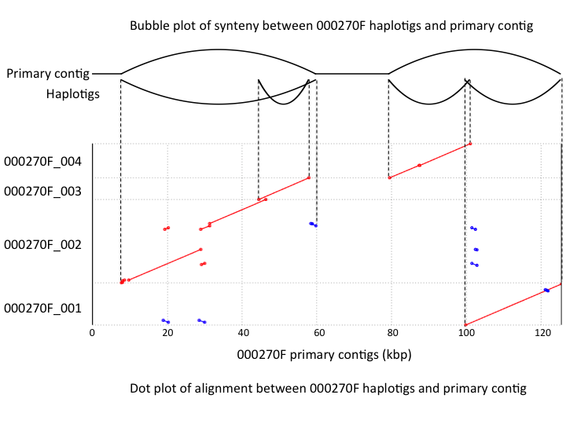

## haplotigtools
A pipeline to analyze the haplotigs and primary contigs assembled by PacBio Falcon and Falcon-Unzip

## Requirements
* mummer
* python 3.0+
* Biopython

## Examples
* see folder Example
* The result is also illustrated below.

