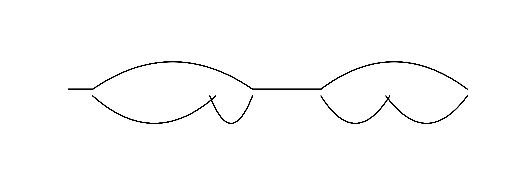

### Example
1. Input file is the fasta files from falcon/falcon-unzip output. It should contain both the primary contigs and haplotigs. The syntax of haplotigs should be in the format of <primary_contig>_number.
   The example.fasta.gz file contains a primary contig named as 000270F, and 4 corresponding haplotigs named as 000270F_001, 000270F_002, 000270F_003 and 000270F_004.  

2. The first command is to "extract" primary contig and haplotig sequences from the "combined" file and save to two files, namely 000270F_p.fa and 000270F_h.fa.
```
python src/extract_fasta.py 000270F example.fasta
or
python src/extract_fasta.py 000270F < example.fasta
```
3. Run NUCmer alignment on the primary and haplotig sequences. The output is 000270F.delta and 000270F.coords (after filtering).
```bash
contig=000270F
nucmer -prefix=$contig ${contig}_p.fa ${contig}_h.fa
delta-filter -r -1 ${contig}.delta | show-coords -r -T -l -d -c /dev/stdin | awk 'NR>4' | sort -k14,14 -k15,15 -k1n,1 > ${contig}.coords
```
4. Finally, run the "chain" or "aggregation" function to identify syntany blocks. The output will be 000270F.loc.coords
```
python src/aggressive_syntany.py ${contig}.coords ${contig} > ${contig}.loc.coords
```
The result is also illustrated below:


The top is the bubble plot showing corresponding regions of primary contig and haplotigs. Below is a mummerplot showing the filtered alignment from NUCmer run. In this example, the tiny "blue" line at the end of haplotig 000270F_002 drove the creation of the nested bubbles over the first bubble region in primary contig. By fine-tuning the -d (--dist, default 15000bp, so named "aggressive") parameter, the nested bubbles could be resovled into two bubbles that are placed side-by-side to cover the first primary bubble, e.g.
```
python src/aggressive_syntany.py ${contig}.coords ${contig} -d 5000 > ${contig}.loc.coords
```
And the result is:


5. As a coutesy, I also included a small R script that can produce the bubble plot. To run it:
```R
contig_size=125443
Rscript --vanilla src/bubbleplot.R ${contig}.loc.coords ${contig_size}
```
